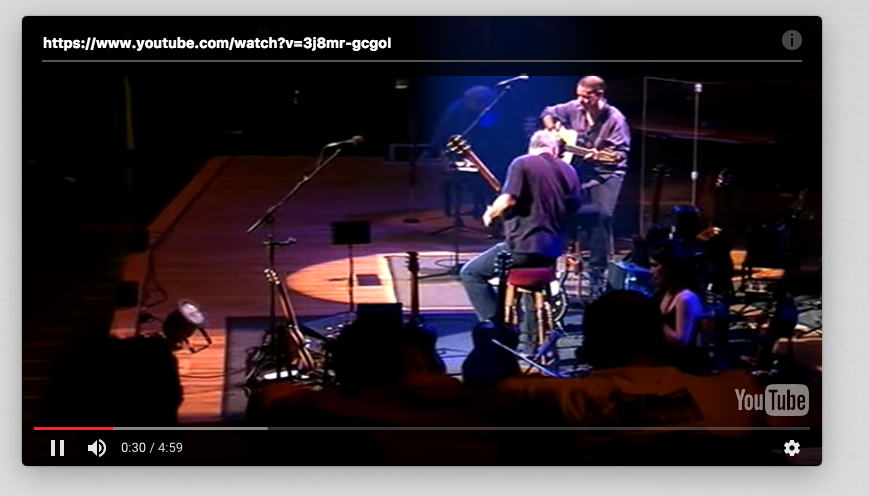

# watcher
A small Electron Mac Desktop App for headless Youtube Video consumption. Features (almost) complete Youtube URL and video id parsing. The window is always on top, as well as locked to 16:9 aspect ratio. An input field for url and id pasting appears on top of the window when hovering over it, the rest of the window is draggable, except for the bottom part, where the controls live. Shiny.

Untested on Windows and Linux.

URL and ID parsing has been tested with the following url formats:

```
[
'http://www.youtube.com/user/Scobleizer#p/u/1/1p3vcRhsYGo',
'http://www.youtube.com/watch?v=cKZDdG9FTKY&feature=channel',
'http://www.youtube.com/watch?v=yZ-K7nCVnBI&playnext_from=TL&videos=osPknwzXEas&feature=sub',
'http://www.youtube.com/ytscreeningroom?v=NRHVzbJVx8I',
'http://www.youtube.com/user/SilkRoadTheatre#p/a/u/2/6dwqZw0j_jY',
'http://youtu.be/6dwqZw0j_jY',
'http://www.youtube.com/watch?v=6dwqZw0j_jY&feature=youtu.be',
'http://youtu.be/afa-5HQHiAs',
'http://www.youtube.com/user/Scobleizer#p/u/1/1p3vcRhsYGo?rel=0',
'http://www.youtube.com/watch?v=cKZDdG9FTKY&feature=channel',
'http://www.youtube.com/watch?v=yZ-K7nCVnBI&playnext_from=TL&videos=osPknwzXEas&feature=sub',
'http://www.youtube.com/ytscreeningroom?v=NRHVzbJVx8I',
'http://www.youtube.com/embed/nas1rJpm7wY?rel=0',
'http://www.youtube.com/watch?v=peFZbP64dsU',
'http://youtube.com/v/dQw4w9WgXcQ?feature=youtube_gdata_player',
'http://youtube.com/vi/dQw4w9WgXcQ?feature=youtube_gdata_player',
'http://youtube.com/?v=dQw4w9WgXcQ&feature=youtube_gdata_player',
'http://www.youtube.com/watch?v=dQw4w9WgXcQ&feature=youtube_gdata_player',
'http://youtube.com/?vi=dQw4w9WgXcQ&feature=youtube_gdata_player',
'http://youtube.com/watch?v=dQw4w9WgXcQ&feature=youtube_gdata_player',
'http://youtube.com/watch?vi=dQw4w9WgXcQ&feature=youtube_gdata_player',
'http://youtu.be/dQw4w9WgXcQ?feature=youtube_gdata_player'
];
```



## usage
Just change to the checked out directory, run ``npm install``, and start the app by running ``electron .``
